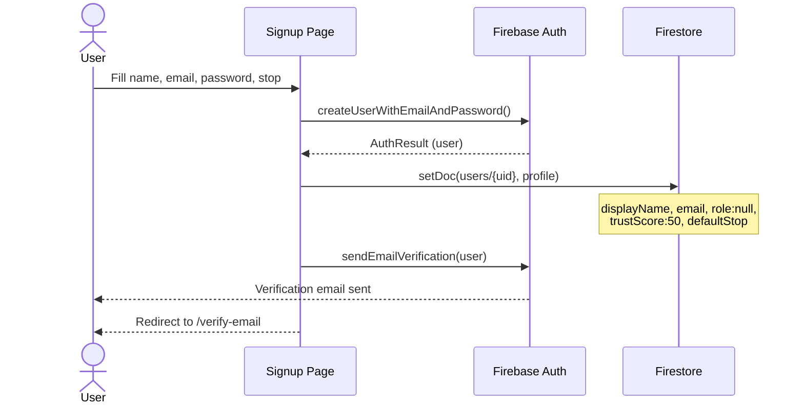
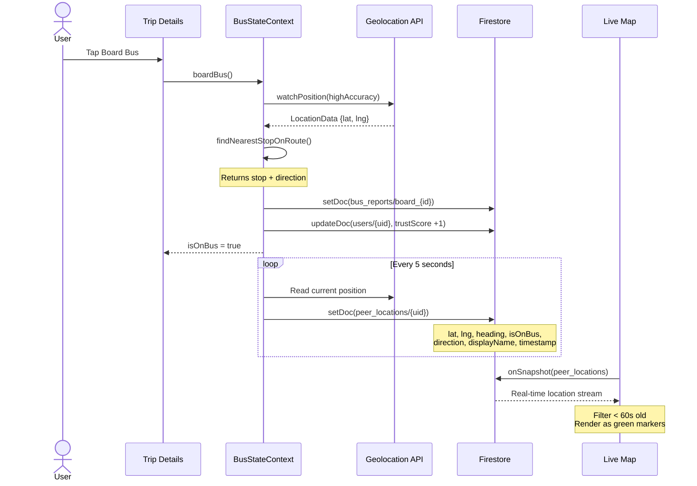
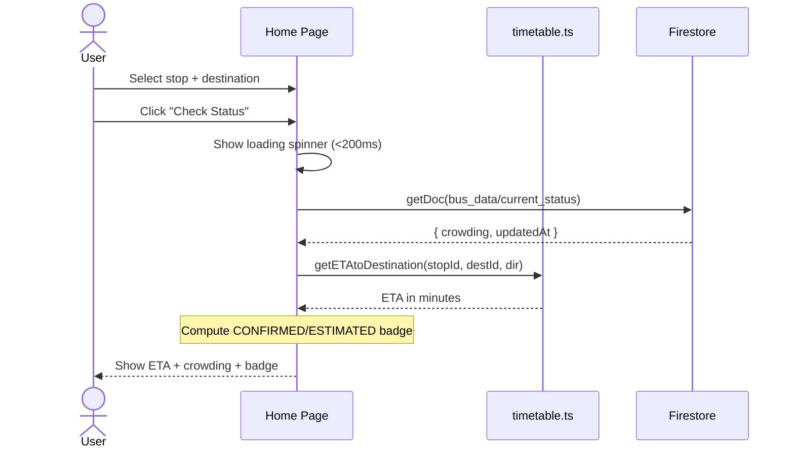

# Architecture Diagram

**Team:** Bandersnatch
**Product:** Bus #3 Real-Time Tracker
**Date:** May 13, 2026
**Version:** 1.0

---

## System Architecture Diagram

```mermaid
graph TB
    %% ── STYLING ──
    classDef user fill:#e8f5e9,stroke:#2e7d32,stroke-width:2px
    classDef client fill:#e3f2fd,stroke:#1565c0,stroke-width:2px
    classDef server fill:#fff3e0,stroke:#e65100,stroke-width:2px
    classDef data fill:#f3e5f5,stroke:#6a1b9a,stroke-width:2px
    classDef auth fill:#fce4ec,stroke:#c62828,stroke-width:2px
    classDef external fill:#e0f2f1,stroke:#00695c,stroke-width:2px
    classDef infra fill:#f5f5f5,stroke:#424242,stroke-width:2px,stroke-dasharray: 5 5

    %% ── USER ──
    User(["👤 User (Browser / Mobile)"]):::user

    %% ── CLIENT TIER (Next.js App Router) ──
    subgraph CLIENT [CLIENT TIER — Next.js 16 App Router]
        direction TB
        
        Middleware["Middleware
        ──────────────
        Locale detection
        /en → EN  /ka → KA
        Redirect / → /en"]:::server
        
        subgraph PAGES [Pages]
            Home["Home /[lang]
            ────────────
            Stop selector
            Check Status
            ETA + Crowding
            Active buses
            Alerts list"]
            
            Login["Login
            ────────────
            signInWithEmail
            &Password"]
            
            Signup["Signup
            ────────────
            createUserWith
            EmailAndPassword
            write users/{uid}"]
            
            VerifyEmail["Verify Email
            ────────────
            Poll email
            Verified every 3s"]
            
            TripDetails["Trip Details
            ────────────
            Board / Disembark
            Not Here / Bus Here
            Crowding report
            Location sharing"]
            
            LiveMap["Live Map
            ────────────
            Route polylines
            Peer markers
            Simulated buses
            User location"]
            
            Routes["Routes
            ────────────
            Schedule info
            Stop timeline"]
            
            Account["Account
            ────────────
            Profile picture
            Trust score gauge
            Badges
            Ride history link"]
            
            Admin["Admin
            ────────────
            Trust management
            Role management
            Batch metrics"]
            
            RideHistory["Ride History
            ────────────
            Past rides list
            Expandable details"]
            
            Feedback["Feedback
            ────────────
            Crowding level
            Empty/Normal/Packed"]
            
            Onboarding["Onboarding
            ────────────
            6-step wizard"]
        end
        
        subgraph COMPONENTS [Shared Components]
            TopNav["TopNav
            ────────────
            Theme toggle
            Language toggle
            Nav links"]
            
            BottomNav["BottomNav
            ────────────
            Mobile tab bar
            Home/Map/Schedule
            /Feedback/Admin"]
            
            AlertBanner["AlertBanner
            ────────────
            Firestore onSnapshot
            bus_data/alert"]
            
            StopSelect["StopSelect
            ────────────
            Headless UI Listbox
            14 station stops
            12 city stops"]
            
            LiveMapC["LiveMap
            ────────────
            Leaflet + OSM tiles
            Route polylines
            Peer onSnapshot
            Animated buses"]
            
            OnBusBanner["OnBusBanner
            ────────────
            Sticky banner
            Next stop + ETA"]
            
            ReportButton["ReportButton
            ────────────
            Issue reporting
            write alerts/{id}"]
        end
        
        subgraph CONTEXT [Context Providers]
            AuthCtx["AuthProvider
            ────────────
            onAuthStateChanged
            Firestore profile
            updateProfile"]
            
            BusStateCtx["BusStateProvider
            ────────────
            Boarding state
            Location sharing
            Bus reports
            Trust score ops"]
        end
        
        subgraph HOOKS [Custom Hooks]
            useUserLocH["useUserLocation
            ────────────
            watchPosition
            highAccuracy"]
            
            useNotifH["useNotifications
            ────────────
            FCM getToken
            Foreground messages
            Permission mgmt"]
            
            useEmailVerH["useEmailVerification
            ────────────
            Route guard
            Poll verification"]
            
            useDictH["useDictionary
            ────────────
            Locale from path
            Return EN/KA dict"]
        end
    end

    %% ── DATA TIER ──
    subgraph DATA [DATA TIER — Firestore]
        direction TB
        
        Users["users/{userId}
        ────────────────
        displayName, email, role
        trustScore, defaultStop
        profilePicture, createdAt
        
        └─ fcmTokens/{tokenId}
        └─ public/{doc}"]
        
        BusReports["bus_reports/{reportId}
        ────────────────
        userId, action, type
        direction, stopId
        level, timestamp"]
        
        PeerLocations["peer_locations/{userId}
        ────────────────
        lat, lng, heading
        direction, isOnBus
        displayName, timestamp
        ⚡ Written every 5s"]
        
        BusData["bus_data/
        ────────────────
        current_status
        ├─ crowding, updatedAt
        
        alert
        ├─ active, message(EN/KA)
        ├─ severity, link"]
        
        Buses["buses/{busId}
        ────────────────
        name, isActive
        status, lastUpdated"]
        
        Alerts["alerts/{alertId}
        ────────────────
        busId, reason
        userId, timestamp
        status"]
    end

    %% ── EXTERNAL SERVICES ──
    subgraph EXTERNAL [EXTERNAL SERVICES]
        FirebaseAuth["Firebase Auth
        ────────────
        Email/password
        Email verification
        Session management"]
        
        FCM["Firebase Cloud
        Messaging
        ────────────
        Push notifications"]
        
        OSRM["OSRM API
        ────────────
        Route polylines
        Road-following
        geoJSON output"]
        
        OSMTiles["OpenStreetMap
        Tiles
        ────────────
        Map tile layers
        Dark + Light themes"]
        
        GA4["Google Analytics 4
        (Planned)
        ────────────
        7 events
        500K events/mo free"]
    end

    %% ── INFRASTRUCTURE ──
    subgraph INFRA [INFRASTRUCTURE]
        Vercel["Vercel
        ────────────
        Auto-deploy on
        PR merge to main
        HTTPS + CDN
        Env variables"]
        
        SW["Service Worker
        ────────────
        bandersnatch-v1 cache
        bandersnatch-tiles-v1
        500-entry LRU
        Push notifications"]
    end

    %% ── EDGES: USER → CLIENT ──
    User -->|"HTTPS request<br>`/[lang]/...`"| Middleware
    Middleware -->|"Route to page"| Pages
    User -->|"Install prompt"| SW
    
    %% ── EDGES: CLIENT → DATA (writes) ──
    Signup -->|"setDoc users/{uid}"| Users
    Feedback -->|"setDoc bus_data/current_status<br>{ merge: true }"| BusData
    TripDetails -->|"setDoc bus_reports/board_*"| BusReports
    TripDetails -->|"setDoc peer_locations/{uid}<br>every 5 seconds"| PeerLocations
    TripDetails -->|"deleteDoc peer_locations/{uid}"| PeerLocations
    ReportButton -->|"addDoc alerts/{autoId}"| Alerts
    Account -->|"updateDoc users/{uid}<br>profile picture / stop"| Users
    Admin -->|"updateDoc users/{uid}<br>trustScore / role"| Users
    
    %% ── EDGES: CLIENT → DATA (reads) ──
    Home -->|"getDoc bus_data/current_status"| BusData
    Home -->|"getDocs buses"| Buses
    Home -->|"getDocs alerts"| Alerts
    AlertBanner -->|"onSnapshot bus_data/alert"| BusData
    LiveMapC -->|"onSnapshot peer_locations"| PeerLocations
    RideHistory -->|"query bus_reports<br>where userId == uid"| BusReports
    Account -->|"getDoc users/{uid}"| Users
    Admin -->|"getDoc users/{uid}"| Users
    
    %% ── EDGES: AUTH FLOW ──
    Login -->|"signInWithEmailAndPassword"| FirebaseAuth
    Signup -->|"createUserWithEmailAndPassword"| FirebaseAuth
    Signup -->|"sendEmailVerification"| FirebaseAuth
    AuthCtx -->|"onAuthStateChanged"| FirebaseAuth
    AuthCtx -->|"getDoc users/{uid}"| Users
    AuthCtx -->|"setDoc users/{uid}<br>{ merge: true }"| Users
    
    %% ── EDGES: NOTIFICATIONS ──
    useNotifH -->|"getToken(messaging)"| FCM
    FCM -->|"Push notification"| SW
    SW -->|"Show notification"| User
    
    %% ── EDGES: MAP ──
    LiveMapC -->|"Fetch route geometry<br>GET /route/v1/driving/..."| OSRM
    LiveMapC -->|"Tile request"| OSMTiles
    SW -->|"Cache tile / serve"| OSMTiles
    LiveMapC -->|"Tile request via SW"| OSMTiles
    
    %% ── EDGES: ANALYTICS (planned) ──
    Pages -.->|"gtag() events<br>(planned)"| GA4
    
    %% ── EDGES: DEPLOYMENT ──
    Vercel -->|"Serve Next.js build"| Middleware
    Vercel -->|"Provide env vars"| CLIENT
```



---

## Data Flow Diagrams

### Signup Flow



### Boarding + Location Sharing Flow



### Bus Status Check Flow



---

## Route Data Model

```
Direction 1 (toStation):
  Colchis Fountain ─(7min)─ Bazaar ─(7min)─ ... ─(7min)─ Rioni Railway Station
  │ stopId: 1                                              │ stopId: 14

Direction 2 (toCityCentre):
  Railway Station ─(7min)─ Campus Station ─(7min)─ ... ─(7min)─ Colchis Fountain
  │ stopId: 1                                              │ stopId: 12
```

**Key constraint:** Stop IDs are direction-dependent. Stop "1" in `toStation` is Colchis Fountain; stop "1" in `toCityCentre` is Railway Station.

---

## Security Boundary Diagram

```
┌────────────────────────────────────────────────────────────┐
│                    PUBLIC (No Auth Required)                 │
│                                                            │
│  peer_locations  (read: anyone)                             │
│  bus_reports     (read: anyone)                             │
│  bus_data        (read: anyone)                             │
│  buses           (read: anyone)                             │
│  alerts          (read: anyone)                             │
│  users/{uid}/public (read: anyone)                          │
├────────────────────────────────────────────────────────────┤
│                  AUTHENTICATED USERS                        │
│                                                            │
│  peer_locations/{uid}  (write: only own uid)                │
│  bus_reports           (write: any auth user)               │
│  alerts                (write: any auth user)               │
│  buses                 (write: any auth user)               │
│  users/{uid}           (write: self, limited fields)        │
├────────────────────────────────────────────────────────────┤
│                     ADMIN ONLY                              │
│                                                            │
│  users/{uid}.role         (write: admin)                    │
│  users/{uid}.trustScore   (write: admin)                    │
│  users/{uid}.totalReportsMade (write: admin)                │
└────────────────────────────────────────────────────────────┘
```

---

## Component Dependency Tree

```
Root Layout
├── ThemeProvider (class-based dark mode)
│   └── AuthProvider
│       └── ClientProviders
│           └── BusStateProvider
│               ├── TopNav
│               │   ├── Theme toggle (class list)
│               │   ├── Language toggle (EN/KA)
│               │   ├── Desktop nav links
│               │   └── Account icon link
│               ├── AlertBanner
│               │   └── Firestore onSnapshot: bus_data/alert
│               ├── AnimatePresence
│               │   └── Page (via template.tsx)
│               ├── StopSelect (Headless UI Listbox)
│               ├── OnBusBanner (sticky, GPS-driven)
│               ├── OnBusButton (floating FAB)
│               ├── ReportButton (floating FAB + modal)
│               └── BottomNav
│                   ├── Home link
│                   ├── Live Map link
│                   ├── Schedule link
│                   ├── Feedback link
│                   └── Admin link (role-gated)
```

---

## Change Log

| Date | Version | Changes | Author |
|---|---|---|---|
| May 13, 2026 | 1.0 | Initial architecture diagram | Team Bandersnatch |

---

*Architecture Diagram | Bandersnatch | CS-PD-2026 | Spring 2026*
